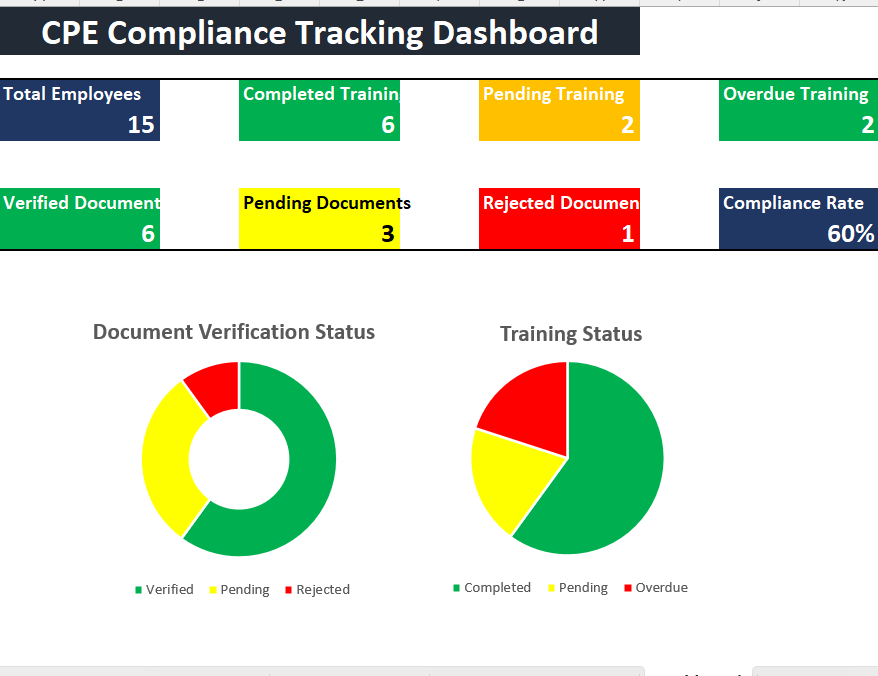

# CPE Compliance Tracking Dashboard

## Overview
An interactive Excel dashboard developed to monitor employee CPE (Continuing Professional Education) compliance.

## Features
- Employee Training Tracker
- Document Verification Tracker
- KPI Cards
- Training Status Chart
- Document Verification Chart
- Compliance Rate Calculation
- Slicers for filtering Training Type and Status
- Dynamic Dashboard

## Tools Used
- Microsoft Excel
- Pivot Tables
- Pivot Charts
- Slicers
- Conditional Formatting
- Excel Formulas

## Dashboard Preview

## Project Files
- CPE_Compliance_Tracking_Dashboard.xlsx
- dashboard.png

## Skills Demonstrated
- Data Analysis
- Dashboard Design
- Excel Reporting
- Data Visualization
- KPI Tracking
